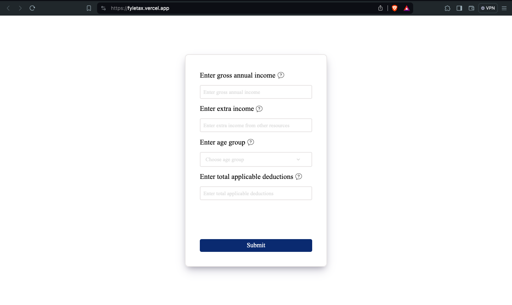

# Fyle TAX Calculator

This is a simple web-based tax calculator designed to calculate taxes based on various input parameters such as gross annual income, extra income, age group, and applicable deductions. It provides users with a convenient way to estimate their tax liabilities.

## Features

- **Gross Annual Income Input**: Users can input their gross annual income, which is the total salary in a year before any deductions.
- **Extra Income Input**: Users can input any extra income from other resources.
- **Age Group Selection**: Users can select their age group from predefined options.
- **Applicable Deductions Input**: Users can input the total applicable deductions.
- **Validation**: The calculator validates input fields to ensure that only numbers are entered.
- **Tooltip Information**: Each input field is accompanied by a tooltip icon that provides additional information when hovered over.
- **Modal Display**: Upon submission of the form, the result is displayed in a modal window.

## Technologies Used

- **HTML**: The structure of the web page is defined using HTML.
- **CSS**: Styling for the web page is done using CSS. The `style.css` file contains the styles for this calculator.
- **JavaScript**: The functionality of the calculator, including input validation and result calculation, is implemented using JavaScript. The `index.js` file contains the JavaScript code.
- **Icons**: Icons used in the tooltips and error messages are sourced from [Icons8](https://icons8.com/).

## Usage

1. Clone or download the repository to your local machine.
2. Open `index.html` in a web browser.
3. Fill in the required input fields: gross annual income, extra income, age group, and applicable deductions.
4. Ensure that only numbers are entered in the input fields.
5. Click the "Submit" button to calculate the tax.
6. The result will be displayed in a modal window.

## Live

1.

## Screenshots

